# 🎭 Playwright Image Downloader

A sophisticated TypeScript-based Playwright service for downloading images from Unsplash with proper authentication, retry logic, and browser automation. Built with a modular service architecture, this tool provides a more reliable alternative to traditional API-based downloading by actually visiting the Unsplash website and handling authentication naturally.

## ✨ Features

- **🔐 Smart Authentication**: Automatic login to Unsplash with fallback to manual login
- **🚀 Concurrent Downloads**: Configurable concurrency for faster downloads
- **🔄 Retry Logic**: Robust retry mechanism with exponential backoff
- **📊 Progress Tracking**: Real-time progress reporting and statistics
- **🎯 Selective Downloads**: Skip already downloaded images automatically
- **📝 Manifest Generation**: Creates detailed local manifest of downloaded images
- **🖥️ Debug Mode**: Visual debugging with DevTools support
- **⚙️ Highly Configurable**: Extensive configuration options via CLI or environment
- **🏗️ Modular Architecture**: Service-oriented design with dependency injection
- **📘 TypeScript**: Full type safety with comprehensive type definitions
- **🔥 Hot Reload**: Development mode with instant TypeScript compilation
- **🧪 Testing**: Playwright test framework integration

## 🚀 Quick Start

### Prerequisites

- Node.js 18+
- An Unsplash account and API access key
- Existing `unsplash-manifest.json` file

### Installation

1. Navigate to the tool directory:

```bash
cd tools/playwright-image-downloader
```

2. Install dependencies:

```bash
pnpm install
```

3. Install Playwright browsers:

```bash
pnpm run install-browsers
```

4. Set up environment variables:

```bash
cp .env.example .env
# Edit .env with your credentials
```

### Basic Usage

```bash
# Build and download all images from manifest (headless mode)
pnpm run download

# Development mode with hot reload (recommended for development)
pnpm run download:dev

# Download with visible browser (useful for debugging/manual login)
pnpm run download -- --no-headless

# Development mode with visible browser
pnpm run download:dev -- --no-headless

# Check environment setup
pnpm run download -- check

# List images that would be downloaded
pnpm run download -- list

# Download with custom settings
pnpm run download -- --size large --timeout 45000 --retries 5 --limit 10
```

## 📋 Commands

### Main Download Command

```bash
pnpm run download [options]
```

**Options:**

- `-h, --headless`: Run in headless mode (default: true)
- `--no-headless`: Run with visible browser
- `-d, --debug`: Enable debug mode with DevTools
- `-t, --timeout <number>`: Timeout in milliseconds (default: 30000)
- `-r, --retries <number>`: Number of retry attempts (default: 3)
- `-s, --size <size>`: Preferred image size (original, large, medium, small)
- `-l, --limit <number>`: Limit the number of images to download
- `--manifest-path <path>`: Path to the manifest file
- `--download-dir <path>`: Download directory
- `--dry-run`: Show what would be downloaded without downloading

### Environment Check

```bash
pnpm run download -- check
```

Validates your environment configuration and shows the status of required/optional environment variables.

### List Images

```bash
pnpm run download -- list
```

Shows all images in the manifest that would be downloaded, including author information and descriptions.

## 🛠️ Development

### TypeScript Development Scripts

```bash
# Development mode (uses tsx for hot reload)
pnpm run download:dev

# Build TypeScript to JavaScript
pnpm run build

# Build in watch mode (rebuilds on file changes)
pnpm run build:watch

# Type checking without compilation
pnpm run type-check

# Clean build artifacts
pnpm run clean
```

### Testing

```bash
# Run Playwright tests
pnpm run test

# Run tests with UI mode
pnpm run test:ui

# Debug tests
pnpm run test:debug
```

### Architecture

The tool is built with a modular TypeScript architecture featuring:

- **Service-Oriented Design**: Each major functionality is encapsulated in a dedicated service class
- **Dependency Injection**: Services are injected through constructors for better testability
- **Type Safety**: Comprehensive TypeScript types ensure runtime reliability
- **Command Pattern**: CLI commands are implemented as separate classes with a common interface
- **Configuration Management**: Centralized configuration with environment variable support
- **Error Boundaries**: Structured error handling with detailed logging and recovery mechanisms

### API Usage

The tool can be used programmatically:

```typescript
import { PlaywrightImageDownloader, Config } from "./src/index.js";

// Simple usage
const downloader = new PlaywrightImageDownloader({
  headless: false,
  debug: true,
  concurrency: 5,
});

const result = await downloader.run();
console.log("Downloaded:", result.stats.downloaded, "images");

// Advanced usage with individual services
import {
  BrowserManager,
  ManifestService,
  DownloadService,
  FileSystemService,
} from "./src/index.js";

const config = new Config({ timeout: 60000 });
const browserManager = new BrowserManager(config);
const fsService = new FileSystemService(config);
const manifestService = new ManifestService(config, fsService);
const downloadService = new DownloadService(config);

// Custom workflow implementation
await browserManager.initialize();
const { imageEntries } = await manifestService.getProcessedImageEntries();
// ... custom processing
await browserManager.cleanup();
```

## ⚙️ Configuration

### Environment Variables

Create a `.env` file based on `.env.example`:

```bash
# Required
UNSPLASH_ACCESS_KEY=your_access_key_here

# Optional (enables auto-login)
UNSPLASH_EMAIL=your_email@example.com
UNSPLASH_PASSWORD=your_password_here

# Optional configuration overrides
PLAYWRIGHT_TIMEOUT=30000
PLAYWRIGHT_RETRIES=3
PLAYWRIGHT_PREFERRED_SIZE=original
PLAYWRIGHT_LIMIT=0
PLAYWRIGHT_HEADLESS=true
PLAYWRIGHT_DEBUG=false
```

### Command Line Overrides

All environment variables can be overridden via command line:

```bash
pnpm run download -- \
  --concurrency 5 \
  --timeout 45000 \
  --retries 2 \
  --no-headless \
  --debug
```

## 🔐 Authentication

The tool supports multiple authentication approaches:

### 1. Automatic Login (Recommended)

Set `UNSPLASH_EMAIL` and `UNSPLASH_PASSWORD` in your `.env` file. The tool will automatically log in to Unsplash.

### 2. Manual Login

If credentials are not provided, you can:

- Run with `--no-headless` to see the browser
- The tool will pause and wait for you to log in manually
- Press Enter in the terminal when login is complete

### 3. No Authentication

The tool can work without authentication, but download quality and availability may be limited.

## 📁 File Organization

```
tools/playwright-image-downloader/
├── src/                           # TypeScript source files
│   ├── index.ts                   # Public API entry point
│   ├── cli.ts                     # CLI application entry point
│   ├── PlaywrightImageDownloader.ts # Main orchestrator class
│   ├── auth/
│   │   └── AuthenticationService.ts # Unsplash authentication logic
│   ├── browser/
│   │   └── BrowserManager.ts      # Playwright browser lifecycle
│   ├── cli/
│   │   ├── CliApplication.ts      # CLI framework and routing
│   │   ├── EnvironmentChecker.ts  # Environment validation
│   │   ├── OptionParser.ts        # Command line argument parsing
│   │   ├── OutputFormatter.ts     # Console output formatting
│   │   └── commands/              # Individual CLI commands
│   ├── config/
│   │   └── Config.ts              # Configuration management
│   ├── download/
│   │   └── DownloadService.ts     # Image download logic
│   ├── fs/
│   │   └── FileSystemService.ts   # File operations
│   ├── manifest/
│   │   └── ManifestService.ts     # Manifest processing
│   ├── stats/
│   │   └── StatsTracker.ts        # Progress and metrics tracking
│   └── types/
│       └── index.ts               # TypeScript type definitions
├── dist/                          # Compiled JavaScript output
├── tsconfig.json                  # TypeScript configuration
├── playwright.config.js           # Playwright test configuration
├── package.json                   # Dependencies and scripts
├── .env.example                   # Environment template
├── .gitignore                     # Git ignore rules
├── INTEGRATION.md                 # Integration guide
└── README.md                      # This file
```

## 🔄 How It Works

### System Overview

```mermaid
graph TB
    subgraph "Input Sources"
        MDX[📄 MDX Files<br/>with image_url frontmatter]
        ENV[🔐 Environment Variables<br/>UNSPLASH_EMAIL<br/>UNSPLASH_PASSWORD]
    end

    subgraph "Generation Phase"
        PARSER[📝 MDX Parser<br/>Extracts URLs & Metadata]
        MANIFEST_GEN[📋 Manifest Generator<br/>Creates unsplash-manifest.json]
    end

    subgraph "Download Phase"
        CLI[🎭 Playwright Downloader CLI]
        BROWSER[🌐 Browser Automation]
        UNSPLASH[☁️ Unsplash.com<br/>Premium + Free Images]
    end

    subgraph "Output Artifacts"
        SOURCE_MANIFEST[📄 unsplash-manifest.json<br/>Source metadata]
        IMAGES[🖼️ Downloaded Images<br/>.jpg files]
        LOCAL_MANIFEST[📋 local-manifest.json<br/>Download results]
    end

    subgraph "Usage Phase"
        COMPONENT[⚛️ React/Next.js Component]
        DISPLAY[🖥️ Rendered Images]
    end

    %% Flow connections
    MDX --> PARSER
    PARSER --> MANIFEST_GEN
    MANIFEST_GEN --> SOURCE_MANIFEST

    SOURCE_MANIFEST --> CLI
    ENV --> CLI
    CLI --> BROWSER
    BROWSER --> UNSPLASH

    BROWSER --> IMAGES
    CLI --> LOCAL_MANIFEST

    IMAGES --> COMPONENT
    LOCAL_MANIFEST --> COMPONENT
    COMPONENT --> DISPLAY

    %% Styling
    classDef inputClass fill:#e1f5fe
    classDef processClass fill:#f3e5f5
    classDef outputClass fill:#e8f5e8
    classDef usageClass fill:#fff3e0

    class MDX,ENV inputClass
    class PARSER,MANIFEST_GEN,CLI,BROWSER processClass
    class SOURCE_MANIFEST,IMAGES,LOCAL_MANIFEST outputClass
    class COMPONENT,DISPLAY,UNSPLASH usageClass
```



### Detailed Processing Flow

```mermaid
sequenceDiagram
    participant U as User
    participant CLI as CLI Application
    participant Config as Configuration
    participant PathRes as PathResolver
    participant ManPre as ManifestPreloader
    participant Browser as BrowserManager
    participant Auth as AuthService
    participant ManSvc as ManifestService
    participant DlSvc as DownloadService
    participant FS as FileSystemService
    participant Unsplash as Unsplash.com

    U->>CLI: pnpm run download
    CLI->>Config: Initialize with smart path resolution
    Config->>PathRes: Resolve manifest & download paths

    CLI->>ManPre: Preload & validate manifest
    ManPre->>PathRes: Find manifest in common locations
    PathRes-->>ManPre: public/images/unsplash/manifest.json
    ManPre->>FS: Check manifest exists & valid
    ManPre-->>CLI: ✅ Manifest validated

    CLI->>Browser: Initialize Chromium
    Browser-->>CLI: Browser ready

    CLI->>Auth: Attempt auto-login
    Auth->>Browser: Navigate to unsplash.com/login
    Auth->>Unsplash: Submit credentials
    Unsplash-->>Auth: Login successful
    Auth-->>CLI: ✅ Authenticated

    CLI->>ManSvc: Load & process manifest
    ManSvc->>FS: Read unsplash-manifest.json
    FS-->>ManSvc: {"images": {"id": {"author": "..."}}}
    ManSvc-->>CLI: Processed image entries

    loop For each image
        CLI->>DlSvc: downloadImage(photoId, imageData)
        DlSvc->>FS: Check if image exists locally

        alt Image exists
            FS-->>DlSvc: File exists, skip
            DlSvc-->>CLI: {success: true, skipped: true}
        else Image missing
            DlSvc->>Browser: Navigate to photo page
            DlSvc->>Browser: Extract ixid parameter
            DlSvc->>Browser: Click download button
            Browser->>Unsplash: Download unwatermarked image
            Unsplash-->>Browser: Image file
            DlSvc->>FS: Save image file
            FS-->>DlSvc: {filepath, size, filename}
            DlSvc-->>CLI: {success: true, author: "Pankaj Patel"}
        end
    end

    CLI->>FS: Create local manifest
    FS->>FS: Generate local-manifest.json
    FS-->>CLI: Local manifest created

    CLI->>Browser: Cleanup & close
    CLI-->>U: ✅ Download complete with stats
```



### Manifest Structure & Data Flow

```mermaid
graph LR
    subgraph "MDX Frontmatter"
        MDX_FM["---<br/>title: 'Post'<br/>image_url: 'unsplash.com/photo/abc123'<br/>---"]
    end

    subgraph "Source Manifest"
        SOURCE_JSON["📄 unsplash-manifest.json<br/>{<br/>  'abc123': {<br/>    'image_author': 'John Doe',<br/>    'width': 3000,<br/>    'height': 2000,<br/>    'description': '...'<br/>  }<br/>}"]
    end

    subgraph "Processing"
        EXTRACTOR["🔍 URL ID Extractor<br/>unsplash.com/photo/abc123<br/>↓<br/>Photo ID: 'abc123'"]
        BROWSER_DL["🎭 Playwright Download<br/>• Navigate to photo page<br/>• Extract ixid parameter<br/>• Click download button<br/>• Handle Unsplash+ unwatermarked"]
    end

    subgraph "Output Files"
        IMG_FILE["🖼️ abc123.jpg<br/>(Unwatermarked)"]
        LOCAL_JSON["📋 local-manifest.json<br/>{<br/>  'abc123': {<br/>    'local_path': '/images/abc123.jpg',<br/>    'author': 'John Doe',<br/>    'size_bytes': 2048000,<br/>    'downloaded_at': '2025-08-26...',<br/>    'skipped': false<br/>  }<br/>}"]
    end

    subgraph "Component Usage"
        COMPONENT["⚛️ ImageComponent<br/>const manifest = require('local-manifest.json')<br/>const imgPath = manifest['abc123'].local_path<br/>const author = manifest['abc123'].author"]
        RENDERED["🖥️ <img src='/images/abc123.jpg'><br/><span>Photo by John Doe</span>"]
    end

    %% Flow
    MDX_FM --> SOURCE_JSON
    SOURCE_JSON --> EXTRACTOR
    EXTRACTOR --> BROWSER_DL
    BROWSER_DL --> IMG_FILE
    BROWSER_DL --> LOCAL_JSON
    LOCAL_JSON --> COMPONENT
    IMG_FILE --> COMPONENT
    COMPONENT --> RENDERED
```



### Smart Path Resolution Flow

```mermaid
graph TD
    START([CLI Start]) --> CHECK_PROVIDED{"--manifest-path<br/>provided?"}

    CHECK_PROVIDED -->|Yes| RESOLVE_PROVIDED["✅ Use provided path<br/>path.resolve(provided)"]
    CHECK_PROVIDED -->|No| SMART_SEARCH["🔍 Smart Path Search"]

    SMART_SEARCH --> CURRENT["📁 Check current directory<br/>./unsplash-manifest.json"]
    CURRENT --> CURRENT_EXISTS{"Exists?"}
    CURRENT_EXISTS -->|Yes| FOUND_CURRENT["✅ Found in current"]
    CURRENT_EXISTS -->|No| COMMON_DIRS

    COMMON_DIRS["📂 Check common directories<br/>./public/<br/>./assets/<br/>./data/<br/>./static/"] --> COMMON_EXISTS{"Found?"}
    COMMON_EXISTS -->|Yes| FOUND_COMMON["✅ Found in common dir"]
    COMMON_EXISTS -->|No| NESTED_SEARCH

    NESTED_SEARCH["🔍 Check nested paths<br/>./public/images/unsplash/<br/>./assets/images/<br/>./data/unsplash/"] --> NESTED_EXISTS{"Found?"}
    NESTED_EXISTS -->|Yes| FOUND_NESTED["✅ Found in nested path"]
    NESTED_EXISTS -->|No| PARENT_SEARCH

    PARENT_SEARCH["⬆️ Check parent directories<br/>../public/<br/>../../public/<br/>../../../public/"] --> PARENT_EXISTS{"Found?"}
    PARENT_EXISTS -->|Yes| FOUND_PARENT["✅ Found in parent"]
    PARENT_EXISTS -->|No| DEFAULT_FALLBACK

    DEFAULT_FALLBACK["📋 Use default<br/>./public/unsplash-manifest.json<br/>(will be created if needed)"]

    %% All paths lead to manifest loading
    RESOLVE_PROVIDED --> LOAD_MANIFEST["📄 Load & Validate Manifest"]
    FOUND_CURRENT --> LOAD_MANIFEST
    FOUND_COMMON --> LOAD_MANIFEST
    FOUND_NESTED --> LOAD_MANIFEST
    FOUND_PARENT --> LOAD_MANIFEST
    DEFAULT_FALLBACK --> LOAD_MANIFEST

    LOAD_MANIFEST --> PRELOAD_CHECK{"Manifest valid?"}
    PRELOAD_CHECK -->|Yes| SUCCESS["✅ Ready to download"]
    PRELOAD_CHECK -->|No| ERROR_HELP["❌ Show helpful error<br/>• Suggest locations<br/>• Show example structure<br/>• Provide creation tips"]
```



### Service Architecture


### Processing Steps

1. **Initialization**: Launches a Chromium browser instance with optimized settings
2. **Smart Path Resolution**: Uses PathResolver to find manifests in common locations
3. **Manifest Preloading**: Validates manifest existence and structure before processing
4. **Authentication**: Handles login to Unsplash (automatic or manual)
5. **Image Processing**:
   - Visits each image page on Unsplash
   - Extracts ixid parameter for proper download URLs
   - Checks if image already exists locally
   - Clicks the download button (gets unwatermarked Unsplash+ images)
   - Saves the image with proper naming
6. **Metadata Preservation**: Transfers author and metadata from source to local manifest
7. **Retry Logic**: Automatically retries failed downloads with exponential backoff
8. **Local Manifest Creation**: Generates a detailed local manifest with download results
9. **Cleanup**: Closes browser and reports comprehensive statistics

## 📊 Output

The tool provides comprehensive output including:

- Real-time download progress
- Success/failure statistics
- File sizes and storage usage
- Detailed error reporting for failed downloads
- Local manifest creation

Example output:

```
🚀 Starting downloads...

📥 [1/3] Downloading: ZV_64LdGoao
✅ Downloaded: ZV_64LdGoao.jpg (2.34 MB)

⏭️  Skipped (exists): NZYgKwRA4Cg

📊 Download Results:
   ✅ Successfully downloaded: 15
   ⏭️  Skipped (already exist): 3
   ❌ Failed to download: 1
   ⏱️  Total time: 45.2s
   💾 Storage used: 45.67 MB
```

## 🐛 Troubleshooting

### Common Issues

**"Download button not found"**

- The page layout may have changed
- Try running with `--no-headless --debug` to inspect the page
- Check if manual login is required

**"Timeout waiting for download"**

- Increase timeout: `--timeout 60000`
- Check internet connection
- Some images may be larger and take longer

**"Login failed"**

- Verify credentials in `.env` file
- Try manual login with `--no-headless`
- Check if 2FA is enabled (not currently supported)

**"Browser crashes"**

- Try reducing concurrency: `--concurrency 1`
- Ensure sufficient system resources
- Update Playwright browsers: `pnpm run install-browsers`

### Debug Mode

Run with debug flags for troubleshooting:

```bash
pnpm run download -- --no-headless --debug
```

This will:

- Show the browser window
- Opens Browser DevTools
- Provide detailed error information

## 🔧 Advanced Usage

### Custom Paths

```bash
pnpm run download -- \
  --manifest-path /path/to/your/manifest.json \
  --download-dir /path/to/download/folder
```

### Integration with Main Project

Add this to your main project's `package.json`:

```json
{
  "scripts": {
    "download:images:playwright": "cd tools/playwright-image-downloader && pnpm run download"
  }
}
```

Then run from your main project:

```bash
pnpm run download:images:playwright
```

## 🤝 Contributing

1. Fork the repository
2. Create a feature branch
3. Make your changes
4. Test thoroughly
5. Submit a pull request

## 📄 License

This tool is part of the main project and follows the same license terms.
